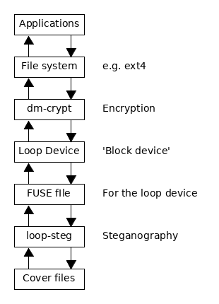

# `loop-steg`: A virtual block device for transparently concealing data inside multiple cover files with steganography, randomly distributing its pieces.

## Explanation

`loop-steg` is a Linux program which uses FUSE to present a virtual file to your file system. The idea is to attach this file to a loop device. Any reads/writes performed on this loop device are translated by `loop-steg` into steganography amongst a directory of cover files. The data to be embedded is split up and randomly distributed about the cover files based on a user-specified seed. Since it's a block device, you can format it with any file system you choose, and use device-level encryption such as dm-crypt.

In other words, you can have a folder on your system, and any files you drop in there are encrypted and embedded randomly among multiple cover files in the background. And this is all done transparently: any files can be embedded by any program, provided you've got the capacity, since it appears to the operating system as a normal folder.

For now, only PNG, BMP and TGA images are supported. To stop `loop-steg`, simply unmount the file system it creates with `sudo umount /mount/point/`. (More details below.)

`loop-steg` comes with three scripts, under `scripts/`, to make setup and general usage easier. This is the simplest way to use the program.

The name comes from [`loop-aes`](http://loop-aes.sourceforge.net/).

## Compilation & Setup

To compile, just run `make` in the directory of the Makefile. The executable will be placed at `./a.out`. For now, this only compiles on Linux systems. You will also need 'stb/stbi_image.h' and 'stb/stbi_image_write.h' to be present. These are Public Domain header files available [here](https://github.com/nothings/stb). Finally, you will need FUSE 3 installed, available in the `fuse3` package on Arch, `libfuse3-dev` on Ubuntu 19.04, and `fuse3-devel` on Fedora. `loop-steg` uses FUSE 3.4, if your distro doesn't provide a version of FUSE 3 this new, try changing the value of `#define FUSE_USE_VERSION` at the top of `src/main.cpp`. (If your FUSE version is too old, this almost certainly won't work.)

Next, you must move `a.out` to somewhere accessible in your `$PATH`, (probably `/usr/bin/loop-steg`), or make a symlink to it, as the helper scripts under `scripts/` will try to run `loop-steg` as `loop-steg`, and run into errors if they can't.

## Usage

### Scripts

These are the scripts, present under `scripts/`:

* `setup.sh`:   Sets up a new file system on a folder of images.
* `mount.sh`:   Mounts an existing file system inside a folder of images.
* `unmount.sh`: Stops loop-steg and undoes any setup. (Loop devices etc.)

Now make them executable:

```shell
$ chmod +x setup.sh mount.sh unmount.sh
```

To use them:

```shell
$ ./setup.sh /path/to/images/ [<FUSE mount options>]
```

This will prompt you for your user password and a desired encryption password for the LUKS volume it is about to create. It will start `loop-steg`, and set up `/mnt/secrets`. Any files placed in this directory are encrypted and hidden within the images at the path you specified. Then when you're done:

```shell
$ ./unmount.sh
```

Closes `/mnt/secrets` and undoes all the setup done by `setup.sh` (e.g. deleting the now-empty folders that were created in `/mnt/` for use as mount points). Bear in mind that writes are cached in memory, so if you made some writes, then unplug your computer without running this, they'll be lost. Then on subsequent uses:

```shell
$ ./mount.sh /path/to/images/ [<FUSE mount options>]
```

Mounts an existing setup to `/mnt/secrets` again, with all your files in there. You can give FUSE mount options. For example, to mount read-only, you could run:

```shell
$ ./mount.sh /path/to/images/ ro
```

For all the FUSE mount options, look at `man 8 mount.fuse3` on Arch Linux. (Might be something else on Ubuntu or other distros, try `man -k fuse` or just Google it.)

### Manually

Here's how to use `loop-steg` yourself, and a bit more about how it works. This process is what the scripts are doing.

To use `loop-steg`:

```shell
$ loop-steg /seed/for/randomness.txt /path/to/images/ /mount/point/ [<FUSE mount options>]
```

Then one file, named `data` will show up in `/mount/point/`. Any reads or writes performed on this file are actually performed on the images at `/path/to/images/`, using steganography of course. The `/seed/for/randomness.txt` file has its contents used as a seed for the random number generator used to write bytes at random locations among the cover files. If you use a different seed, all the bytes in the resulting file will appear in a different order, so make sure to use the same file each time. (The contents don't really matter, just that they are the same between uses. This doesn't necessarily have to be a text file either, it can be anything.)

(There is no option to supply a seed directly for security reasons. You might forget to delete it from your shell's command history, for example.)

You can also supply FUSE mount options. When you pass these options to the scripts, all they're really doing is just forwarding them straight to `loop-steg`, which in turn is forwarding them straight to FUSE. *When you're running `loop-steg` directly, FUSE mount options have to go last!* **Highly recommended:** supply the `-f` (foreground) option at the end, which prevents FUSE's default behaviour of forking into the background. This allows you to see `loop-steg`'s output. (It prints which FUSE functions are being called and the arguments they've been given, which is fun to watch.)

*(Unfortunately I can't find where this `-f` option is documented, so you're on your own if you want to know what other options there are. There's also `-d`, which makes FUSE print lots of debugging information, and `-s` which disables multi-threading with FUSE but NOT the multi-threading done by `loop-steg`, i.e. when unmounting. These might be all of them?)*

So now `loop-steg` has made its virtual file. To make things easier, you're meant to attach this file to a loop device. For the sake of example, suppose that the mount point you chose was `/mnt/loop-steg/`. (You'll have to create this directory yourself of course.) To attach the `data` file to the first available loop device:

```shell
$ sudo losetup -f /mnt/loop-steg/data
```

To find out which loop device the file ended up getting attached to, run:

```shell
$ losetup -a
```

...which lists all the loop devices that are attached to files, and what files are attached to them. (You're looking for the one with `/mnt/loop-steg/data` attached to it, which is very likely `/dev/loop0`.)

Now you've got a loop device, which behaves just like an actual block device (e.g. a hard drive), so you can format it with a filesystem, or whatever else. (Right now it's just filled with uninitialised junk, i.e. the last bits of all the image bytes.) So if you wanted to, assuming that the loop device that `/mnt/loop-steg/data` got attached to was `/dev/loop0`, you could just `sudo mkfs.ext4 /dev/loop0`, to format the loop device with an ext4 filesystem, then `sudo mount /dev/loop0 /some/mount/point/`, to mount it, and now you can start dropping stuff in `/some/mount/point/` and it'll get redistributed and hidden by `loop-steg`.

However, we can add an extra layer of sneakiness by setting up a LUKS volume with cryptsetup. In short, this is intended to facilitate transparent encryption of block devices, by creating another virtual block device. Any reads/writes made to the latter are encrypted and stored to/read from the former. But neither you nor your software need to care about this; the loop device created by cryptsetup can just be treated as a normal block device, and the rest is cryptsetup's problem. (Hmm, where have we seen this before?) So what we can do is initialise an encrypted LUKS volume on the loop device we just created, and use that to transparently encrypt all our hidden data.

This kind of thing is the whole point of `loop-steg`. Using a loop device as an interface means you can do all kinds of jazzy shenanigans like this, without much effort.

So let's actually do it now. Again, say that the loop device `/mnt/loop-steg/data` got attached to is `/dev/loop0`. To create a LUKS volume on this loop device:

```shell
$ sudo cryptsetup luksFormat /dev/loop0
```

It will ask you for an encryption password. In the scripts, your encryption password is the same as the seed used for randomness, for simplicity's sake, but they don't necessarily have to be the same. Enter whatever password you want. Now to open this device. This causes cryptsetup to create that loop device mentioned earlier, which will encrypt operations made on it before passing them to `/dev/loop0`.

```shell
$ sudo cryptsetup open /dev/loop0 loop-steg
```

That last argument, `loop-steg`, is a name given to the opened volume. You can name it whatever you want of course. A loop device with this name should have shown up in `/dev/mapper/`, providing all went well. (We also close it by this name later.) Now we have another loop device which we can do whichever we want with, like earlier. Effectively, LUKS has just added another layer to the whole setup. So, go ahead and format it with ext4:

```shell
$ sudo mkfs.ext4 /dev/mapper/loop-steg
```

And now, we can mount it wherever, for example at `/mnt/secrets/`:

```shell
$ sudo mkdir /mnt/secrets/
$ sudo mount /dev/mapper/loop-steg /mnt/secrets/
```

Now we can copy our files to `/mnt/secrets`. They are encrypted by LUKS, and hidden among the cover files by `loop-steg`. That's it! To help explain this setup, get a load of this diagram:



To undo all this, and go back to how we were, we just do it in reverse:

```shell
$ sudo umount /mnt/secrets/       # Unmount encrypted volume.
$ sudo cryptsetup close loop-steg # Close encrypted device.
$ sudo losetup -d /dev/loop0      # Detach loop device from loop-steg.
$ sudo umount /mnt/loop-steg/     # Stop loop-steg.
```

And remember to clean up after yourself if applicable:

```shell
$ sudo rmdir /mnt/loop-steg/
$ sudo rmdir /mnt/secrets/
```

The last command unmounts `loop-steg`, causing it to flush any cached writes, which is intensive and takes a while. This is where a lot of steganography happens. While this is going on, try:

```shell
$ pgrep loop-steg
```

If this gives you back a PID (Process ID), `loop-steg` is still running, and is probably busy writing to the cover files, so it's not safe to turn off your computer just yet. Once this gives you nothing back, `loop-steg` has finished and everything is back to normal.

Now that we've set everything up, subsequent uses of `loop-steg` (on this folder of images) are easier, because we no longer need to create a LUKS volume, or a filesystem, or whatever:

```shell
$ loop-steg /path/to/seed.txt /path/to/images/ /mnt/loop-steg/
$ sudo losetup -f /mnt/loop-steg/data
$ sudo cryptsetup open /dev/loop0 loop-steg
$ sudo mount /dev/mapper/loop-steg /mnt/secrets/
```
